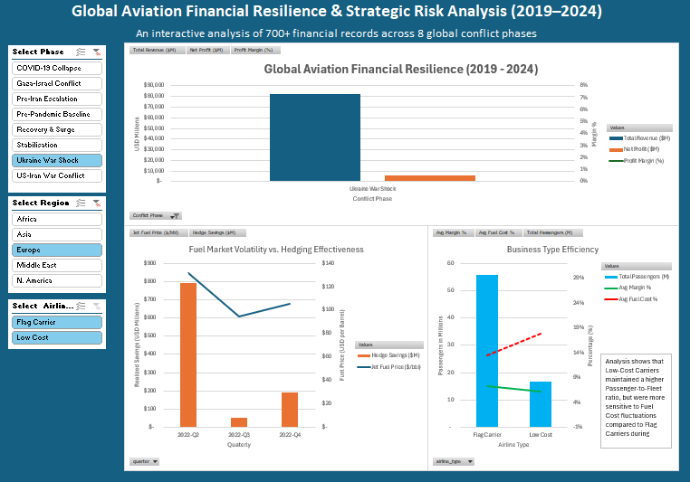

# Global Aviation Financial Resilience & Strategic Risk Analysis (2019–2024)

## Dashboard Preview

## Project Objective
This project analyzes the financial resilience of the global airline industry during major geopolitical shocks. The goal was to visualize the correlation between conflict phases, jet fuel price volatility, and the effectiveness of hedging strategies.

## Tools Used
* **Microsoft Excel:** Advanced Pivot Tables, Power Query (for data cleaning), and Dynamic Dashboarding.
* **Data Visualization:** Dual-axis combo charts, Slicers, and conditional formatting.

## Key Insights
* **The "V" Recovery:** Despite the 33.5% margin drop during COVID-19, revenue fully stabilized by the 2023 "Stabilisation" phase.
* **Hedging Success:** Airlines mitigated peak fuel costs ($140+/bbl) during the Ukraine War Shock through robust hedging, resulting in significant realized savings.
* **Business Model Comparison:** Low-cost carriers demonstrated higher passenger-to-fleet efficiency but showed higher sensitivity to fuel price fluctuations compared to Flag Carriers.

## How to Use
1. Download the `.xlsx` file from this folder.
2. Open in Excel and use the **Slicers** on the left to filter by Region, Airline Type, or Conflict Phase.

## 🔗 Data Sources
* **Primary Dataset:** [Aviation Financials 2019-2024][(https://www.kaggle.com/datasets/zkskhurram/airline-ticket-prices-vs-oil-and-fuel-costs)]

