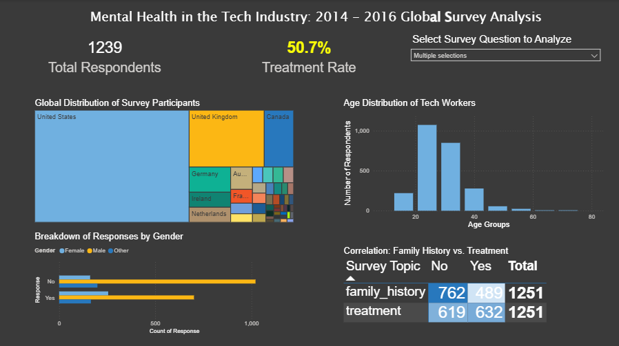
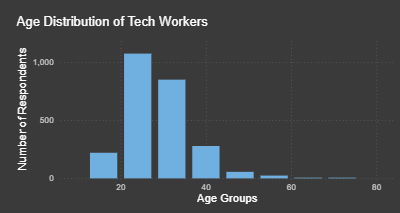

# Mental Health in Tech: Global Survey Analysis (2014–2016)

## Executive Summary
This project analyzes a pivotal dataset of **1,239 tech professionals**...

<b>Click to Expand: The Data Story & Logic</b>

### The "Treatment Gap" Discovery
The core logic of this analysis reveals a powerful trend: **Environment over Genetics.**

* **The Condition:** Only **39%** of respondents reported a known family history.
* **The Action:** However, **50.7%** sought professional treatment.
* **The Insight:** This suggests that tech culture (2014-2016) was a primary driver for seeking care.

### Demographic Breakdown

* **Age Distribution:** Concentrated in the **25–35 age bracket**.
* **Global Scale:** Consistent phenomenon across the US, UK, and Canada.

