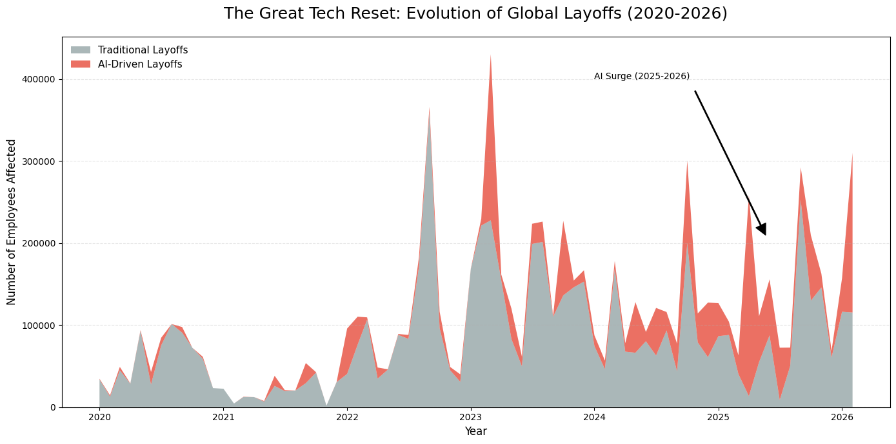

# The Great Tech Reset: AI-Driven Global Layoffs (2020 - 2026)


## Project Overview
This project analyzes the fundamental shift in the technology labor market between 2020 and 2026. Initially triggered by post-pandemic over-hiring, the "Reset" evolved into a structural transformation as companies reallocated human capital budgets toward **Artificial Intelligence (AI) investments**. 

### Visualizing the Trend

*Figure 1: The transition from traditional layoffs (2023) to AI-driven restructuring (2025-2026).*

### Data Source
The primary data for this analysis was sourced from **Kaggle**:
* **Dataset:** [Global AI and Tech Layoffs (2020-2026)](https://www.kaggle.com/datasets/prajitdatta/global-ai-and-tech-layoffs-dataset-20202026)
* **Description:** A comprehensive tracker of global workforce reductions, specifically identifying AI-related strategic shifts and financial impact.

## Project Goals
* **Identify the Pivot Point:** Pinpoint when AI became the primary driver of tech layoffs over traditional market pressures.
* **Geographic Analysis:** Compare how different global tech hubs (USA vs. Singapore/Germany) are reacting to the AI shift.
* **Industry Benchmarking:** Determine which sectors (e.g., Cloud, E-commerce) are being automated most aggressively.

## Data Analysis Process

### 1. Data Cleaning & Standardization
* **Temporal Integrity:** Converted raw strings into Python `datetime` objects to track monthly trends accurately through Feb 2026.
* **Normalization:** Standardized company names and hq_country strings to eliminate duplicates and whitespace errors.
* **Handling Nulls:** Identified missing stock price data as "Private/Non-listed" entities to maintain statistical accuracy.

### 2. Exploratory Data Analysis
* **Timeline Mapping:** Used `plt.stackplot` to visualize the "Two Waves" of the reset.
* **Categorical Grouping:** Leveraged Pandas `groupby` to isolate AI-specific flags.

## Key Insights & The "Data Story"

* **The 2026 AI Surge:** In February 2026, AI-driven layoffs surpassed traditional layoffs for the first time in history.
* **The Singapore Effect:** Singapore showed an AI-intensity rate of **46%**, indicating faster restructuring in high-tech hubs.
* **Sector Vulnerability:** **Software/Cloud** industries are the most "AI-Impacted," with **38.4%** of all layoffs tied to AI strategy.

<details>
<summary><b>Click to Expand: Detailed Analysis & Logic</b></summary>

### Phase 1: The Pandemic Correction (2020-2023)
Initial layoffs were "defensive." Companies cited "Post-Pandemic Overhiring." Python visualizations show a peak in early 2023 that was 80% traditional labor reduction.

### Phase 2: The Structural Reset (2024-2026)
Companies like Google and Amazon began citing "Shift to AI-First Strategy." This represents a **Substitution Effect**—capital is being moved from payroll to AI compute infrastructure.
</details>

## Folder Structure
```text
├── Data/
│   ├── global_ai_tech_layoffs_2020_2026.csv   # Raw dataset
│   └── cleaned_layoffs_data.csv               # Processed data
├── Notebooks/
│   └── Great_Tech_Reset_Analysis.ipynb       # Python Analysis
├── Visualizations/
│   ├── timeline_trend.png                     # Main Overview Image
│   ├── country_comparison.png                 
│   └── industry_impact.png                    
└── README.md
