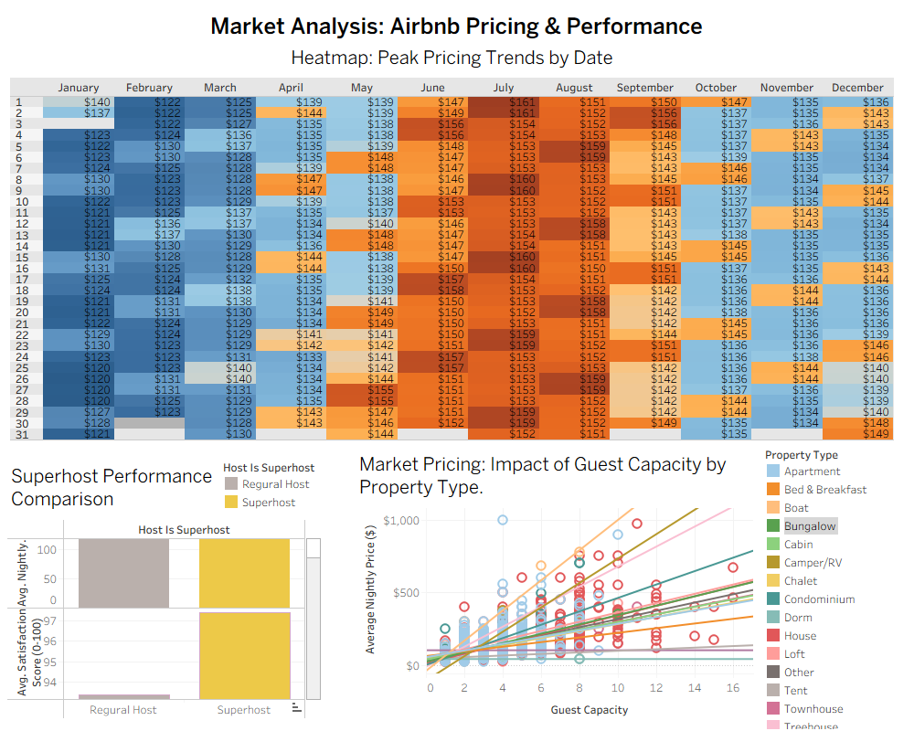

# Airbnb Market Dynamics: Pricing & Performance Analysis

## Project Overview
This project provides a detailed analysis of Airbnb listing and calendar data to uncover **seasonal pricing trends**, **host performance benchmarks**, and **market scaling efficiency**. By joining static listing details with time-series calendar data, I developed an interactive Tableau dashboard to identify high-value investment opportunities and guest behavior patterns.

---

## Strategic Data Insights

### 1. Seasonal Pricing Dynamics (Time-Series Analysis)
* **Peak Demand:** The highest average nightly rates occur in **July ($161)** and **August ($152)**, representing a **32% price surge** over the January baseline ($121).
* **Growth Trend:** Data shows a steady incline starting in **April**, peaking in mid-summer, and stabilizing in **November**.
* **Actionable Insight:** To maximize ROI, hosts should implement **Dynamic Pricing** strategies specifically to capitalize on the 4-month high-demand window from June to September.

### 2. The Superhost Advantage (Categorical Benchmarking)
* **The Quality Gap:** **Superhosts** maintain an elite average satisfaction score of **97.5%**, significantly outperforming regular hosts who average in the sub-94% range.
* **Pricing Strategy:** Despite superior ratings, Superhosts maintain highly competitive pricing (Avg. **$130–$140**). This suggests they prioritize **high occupancy rates** and "Value-for-Money" to protect their status.
* **Data Integrity:** The analysis successfully identified and **excluded 74 null values** in the pricing data, ensuring satisfaction metrics were not skewed by inactive or "placeholder" listings.

### 3. Property Scaling & Market Efficiency (Correlation Analysis)
* **Capacity Impact:** There is a strong positive correlation between **Guest Capacity** and **Price**. However, **Houses and Lofts** exhibit a steeper regression slope than standard Apartments.
* **Premium Outliers:** Identified a "Luxury Niche" where specific **4-guest Apartments** command premiums of **$1,000/night**, operating independently of standard market scaling.
* **Marginal Revenue:** For every additional guest capacity added, the expected nightly rate increases by approximately **$35–$50**, depending on property type.

---

## Technical Methodology

* **Data Cleaning (Excel):** Performed extensive data scrubbing to handle missing values and standardized currency formatting. Specifically, addressed **74 null observations** in the pricing dimension to maintain data integrity.
* **Data Modeling:** Executed a **Left Join** between the `Listings` and `Calendar` tables to synchronize static host attributes with 365 days of dynamic pricing data.
* **Advanced Analytics (Tableau Desktop):**
    * **LOD Expressions:** Used to calculate fixed monthly averages across a granular daily dataset.
    * **Linear Regression:** Modeled the relationship between property capacity and market value to identify high-efficiency property types.
    * **Trend Lines:** Visualized seasonal trajectories to identify predictive pricing patterns.

---

## Dashboard Preview

---

## Project Structure
* `data/`: Contains the raw Excel datasets (Listings & Calendar).
* `tableau/`: The `.twbx` Tableau Packaged Workbook.
* `README.md`: Project documentation and executive summary.

---

## How to Use
1. Clone this repository.
2. Open the `.twbx` file in **Tableau Desktop** (Paid Tier).
3. Use the **Property Type** filters to explore specific market niches.
